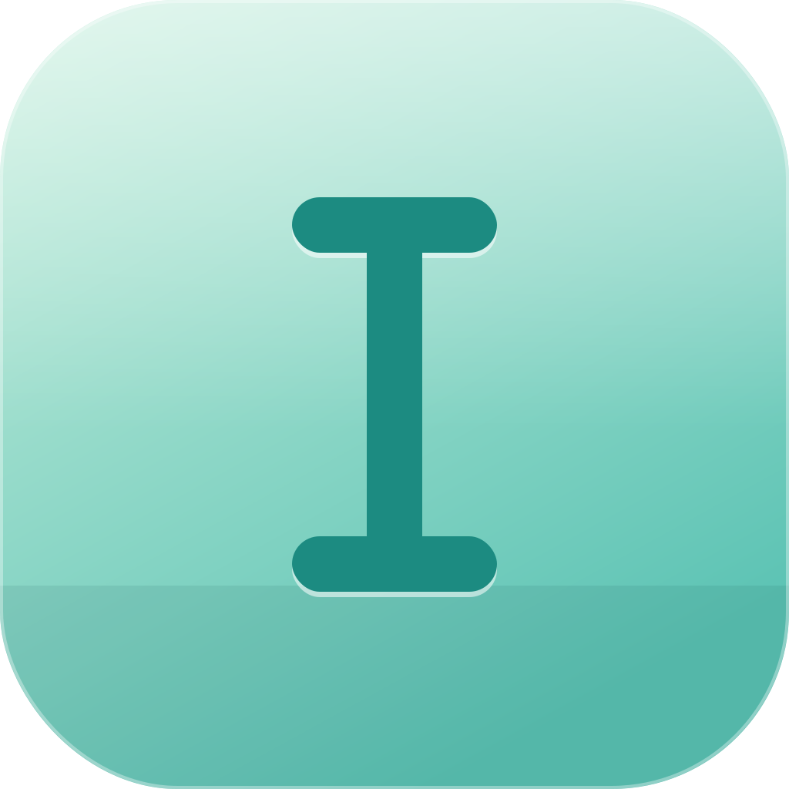

<div align="center">



# Jotty

**Open-source macOS quick-capture for your keyboard.**
Hit a hotkey, brain-dump, and your notes land as plain markdown — optionally parsed into tasks, times, and calendar events by on-device AI.

[](https://github.com/logic-loomer/jotty/actions/workflows/ci.yml)
&nbsp;·&nbsp; macOS 26+ &nbsp;·&nbsp; Swift / SwiftUI &nbsp;·&nbsp; MIT

</div>

---

Jotty lives in your menubar. Press **⌘N** anywhere, type whatever's in your head, and press **⌘↩**. On-device Apple Intelligence quietly turns it into tasks with due dates and time blocks, you glance at the Review list, and it commits to a markdown file you own. No account, no cloud by default, no lock-in — the files on disk are the source of truth, and you can point Jotty straight at your Obsidian vault.

- **Capture in a keystroke** — global ⌘N popup, autosaving drafts, submit with ⌘↩.
- **On-device AI extraction** — Apple Foundation Models parse a brain-dump into tasks, due dates, and time blocks with zero network. Optional Ollama / Claude / OpenAI / Gemini providers behind one switch.
- **Plain-markdown storage** — one file per day in a folder you choose; every feature is an additive token on a normal `- [ ] ` line, so your files stay portable and human-readable.
- **Daily rollover** — unfinished tasks carry forward automatically; recurring tasks and snooze keep the list honest.
- **Calendar, two-way** — time-blocked tasks become real Calendar.app events (linked back to the task), today's events read into the menubar, and edits sync both directions.
- **⌘K command bar** — Spotlight-style fuzzy search across today's tasks, every past day file, inbox suggestions, and app actions.
- **Unified inbox** — items assigned to you elsewhere (GitHub today) surface as suggested tasks you accept or dismiss.
- **Private by default** — the default config makes zero outbound requests; API keys live only in the macOS Keychain, never on disk.

## Contents

- [Install](#install) · [Build from source](#build-from-source)
- [Capturing notes and tasks](#capturing-notes-and-tasks) · [Typed time and due tokens](#typed-time-and-due-tokens)
- [AI task extraction](#ai-task-extraction) · [AI providers](#ai-providers)
- [Calendar](#calendar) · [Command bar](#command-bar) · [Unified inbox](#unified-inbox)
- [Send to Claude](#send-to-claude) · [Settings](#settings) · [Keybindings](#keybindings)
- [Privacy](#privacy) · [Contributing](#contributing) · [License](#license)

## Install

There are no signed binary releases yet (no paid Apple Developer ID), so the supported path today is [building from source](#build-from-source). If a pre-built `.app` is ever attached to a release, macOS will quarantine it — clear the flag with:

```bash
xattr -d com.apple.quarantine /Applications/Jotty.app
```

## Build from source

Requires **macOS 26.0+** (the default on-device extraction uses Apple Intelligence / FoundationModels, which is macOS 26-only) and **Xcode 16+** (Xcode 26 recommended). The Xcode project is generated from `project.yml` by [XcodeGen](https://github.com/yonaskolb/XcodeGen), so install that first:

```bash
brew install xcodegen

git clone https://github.com/logic-loomer/jotty.git
cd jotty
xcodegen generate     # regenerates Jotty.xcodeproj from project.yml
xcodebuild -scheme Jotty -destination 'platform=macOS' build
```

Open `Jotty.xcodeproj` in Xcode and run, or copy the built `.app` from `~/Library/Developer/Xcode/DerivedData/.../Build/Products/Debug/Jotty.app` into `/Applications`. Re-run `xcodegen generate` whenever you add or remove source files — the `.xcodeproj` is generated, not hand-edited.

Jotty runs as a menubar agent (no Dock icon). Look for its icon in the menubar after launch.

## Capturing notes and tasks

Press **⌘N** anywhere to open the capture popup, type freely, and press **⌘↩** to commit (**⎋** cancels and autosaves a draft). Notes are written as markdown, one file per day, to `~/Documents/Jotty/` by default — change the folder in **Settings → Storage**, or point it at your Obsidian vault.

Lines starting with `- [ ] ` are parsed as tasks; everything else is a note:

```
quick brain-dump
- [ ] call mom
- [ ] renew domain
follow-up: check prod logs after lunch
```

→ two tasks ("call mom", "renew domain"); the note section keeps "quick brain-dump" and "follow-up: check prod logs after lunch".

Click the menubar icon to see today's tasks and toggle checkboxes. Incomplete tasks roll forward to today's file at launch and at midnight. Right-click a task for rename, move, delete, repeat, snooze, and Send to Claude.

### Typed time and due tokens

Manual task lines accept a few inline tokens so you can schedule at capture **without any AI provider**. They're whitespace-delimited, case-insensitive, and stripped from the saved title:

| Token | Meaning |
| --- | --- |
| `@3pm`, `@9am`, `@3:30pm` | time block (12-hour, optional `:mm`) |
| `@15:00`, `@9:30` | time block (24-hour, colon form) |
| `@9`, `@15` | time block; a bare hour is 24-hour (`@9` = 09:00) |
| `@today`, `@tomorrow` | due date (and the day for any `@time` on the line) |
| `@mon`…`@sun`, `@friday` | due date on the next matching weekday (today counts) |
| `due:fri`, `due:tomorrow` | due date (same day words as `@`) |
| `due:2026-07-10` | due date (ISO `yyyy-MM-dd`) |

`- [ ] Call dentist @tomorrow @3pm` saves "Call dentist", due tomorrow, with a 30-minute block at 3:00pm. A typed **time** also creates a real Calendar.app event (when access is granted), linked back to the task via `cal_event:`; a `due:`-only token creates no event. Words that only look like tokens (`jane@work.com`, `due:soon`) are left alone, and a line with no token behaves exactly as before.

## AI task extraction

Type a freeform brain-dump, press **⌘↩**, and Jotty silently extracts tasks, due dates, and time blocks using on-device Apple Foundation Models — no network. A Review state shows a row per item with metadata badges (`📅 today 1–2pm`, `📅 due Friday`); navigate with ↑↓, toggle rows with space, edit a title in place, commit with ⌘↩, or ⎋ to return to the raw text.

```
call mom by Friday, block 1-2pm for standup, domain renewal
```

→ three tasks with a due date, a time block, and a calendar block, ready to accept into today's `## Tasks`. Typing `- [ ] …` bypasses AI and lands directly as a task (and the [typed tokens](#typed-time-and-due-tokens) work there too), so you're never blocked if no provider is configured. Apple FM requires macOS 26+; a 30-second undo of a commit is still on the roadmap.

## AI providers

Apple Foundation Models is the default and runs fully on-device. Four more providers sit behind the same `AIProvider` protocol — pick one in **Settings → AI → Provider**; switching takes effect on the next capture, no restart.

| Provider | Locus | Default model | Cost |
|---|---|---|---|
| **Apple Foundation Models** (default) | On-device | system | Free |
| **Ollama** | On-device | `qwen2.5:3b` | Free |
| **Claude** | Cloud (Anthropic) | `claude-haiku-4-5` | ~$0.0001–0.0003 / extraction |
| **OpenAI** | Cloud (OpenAI) | `gpt-4o-mini` | ~$0.0001–0.0003 / extraction |
| **Gemini** | Cloud (Google) | `gemini-2.5-flash` | ~$0.00005–0.0001 / extraction |

The picker groups providers under **On-device** and **Cloud** so the privacy trade-off is visible before you choose. If a provider fails (offline, bad key, rate limit), Review offers a one-tap fallback to Apple FM so a capture is never lost; cloud 5xx/429 are retried with backoff first.

**API keys live in the Keychain, never on disk.** Enter a cloud key once in Settings → AI; Jotty writes it to the macOS Keychain (`kSecClassGenericPassword`, app-scoped, not iCloud-synced) and never reads it back into the UI. There is no config-file or environment-variable key path for the running app. Settings → AI also lists the exact endpoint each provider contacts:

| Provider | Endpoint |
|---|---|
| Apple Foundation Models | none — on-device |
| Ollama | `http://127.0.0.1:11434` (local loopback) |
| Claude | `https://api.anthropic.com/v1/messages` |
| OpenAI | `https://api.openai.com/v1/chat/completions` |
| Gemini | `https://generativelanguage.googleapis.com/v1beta/models/<model>:generateContent` |

**Ollama** can be reused from an existing Homebrew/`.app` install or downloaded and managed by Jotty (signed `Ollama.app`, quarantine stripped, signature verified before launch); the daemon is bound to loopback and model weights live in the standard `~/.ollama/models/`.

## Calendar

Time-blocked tasks can become real macOS Calendar events, and today's events read back into the menubar. **Calendar access is never requested at launch** — the first calendar-touching action triggers the macOS prompt, and denying it simply turns the calendar features off; Jotty keeps working as a plain task tool.

- **Tasks create events.** Committing a task with a time block creates one event on your default calendar (override it in Settings → Calendar) and adds a `cal_event:<id>` token linking the two. Writes are best-effort — a failure logs a notice but never rolls back the markdown, because disk is the source of truth.
- **Overlap warning.** Before writing, Jotty checks for a conflicting event and asks "overlaps with 'Standup' — commit anyway?"
- **Two-way sync.** Editing a task's time updates its event in place; editing the event in Calendar.app prompts Jotty to sync the markdown (Calendar wins) next time it comes forward; deleting a linked task asks once whether to also delete the event.
- **Today's events** appear in a read-only section in the menubar popover; clicking one opens Calendar.app at that date.

**Calendar power-UX** adds recurring tasks, snooze, and a drag-to-schedule canvas — all additive `recur:` / `recur_src:` / `snooze:` tokens on the task line, so older files parse unchanged:

- **Recurring tasks** — right-click → **Repeat** (Daily / Weekdays / Weekly / Custom weekdays). The line becomes a *template* that stays put; rollover writes one fresh instance per matching day (idempotently, via a `recur_src:` marker). Set Repeat back to None to stop.
- **Snooze** — right-click → **Snooze to** (Tomorrow / Next week / a date). The task hides from the list until that day, then returns automatically. Visibility only — the line stays in its original file.
- **Calendar canvas** — an optional window (not a replacement for the dropdown) showing today on a vertical time axis: events as blue blocks, time-blocked tasks as green. Drag an unscheduled task from the rail onto a slot to snap it to 15 minutes, write a `time:` block, and create the linked event; drag a placed block to reschedule it (moves, never duplicates). Open it from the calendar icon in the popover header.

## Command bar

Press **⌘K** from anywhere and a Spotlight-shaped bar drops in near the top of the active screen. It's **non-activating** — the app you were in keeps focus and its menu bar. Esc, clicking outside, or losing focus closes it; ⌘K again toggles it.

Typing fuzzy-matches (subsequence scoring with a word-prefix boost — "dmn" finds "domain renewal") across four corpora, grouped **Actions → Today → Inbox → Earlier → Days** (top 8 per section, 40 overall; an empty query shows an empty bar):

- **Today's tasks** — the live menubar list.
- **All past day files** — every day file and the tasks inside; hits show their origin date, rolled-forward duplicates are collapsed.
- **Inbox suggestions** — already-fetched items from the Unified Inbox.
- **App actions** — new capture, open a Settings tab, open the calendar canvas, toggle launch-at-login, replay onboarding, open today's file.

Enter acts per result kind — a today task jumps to the highlighted menubar row, an earlier task or day file opens in your editor, an inbox item is accepted as a task, an action runs. ↑↓ move the selection (no wrap), ⌘1–9 jump to a visible row, everything is reachable without the mouse. Opening the bar never touches the network — the index is rebuilt in memory from disk plus already-fetched inbox state.

## Unified inbox

Items assigned to you elsewhere surface as **suggested** tasks in a section above your own captures, so external work shows up without leaving Jotty.

- **Accept** writes the item into today's `## Tasks` with `source:` / `source_url:` tokens linking back to the origin, then drops it from the list.
- **Dismiss** is remembered — the item is never suggested again (accepted items are tracked the same way).

The inbox is one `InboxSource` protocol with a transparency registry, so every planned source is visible in Settings before it ships:

| Source | Status | Endpoint |
|---|---|---|
| **GitHub** | Shipped (Personal Access Token) | `https://api.github.com` |
| Gmail / Slack / Linear / Notion | Documented extension points | their respective APIs |

**GitHub** is the shipped source: set a read-scoped PAT in **Settings → Integrations** (stored in the Keychain, never on disk) and Jotty suggests your assigned issues and review-requested PRs. **No background polling by default** — the inbox refreshes when you open the menubar; an opt-in "Check periodically" toggle (OFF by default, 5-minute minimum) is the only timer.

## Send to Claude

Right-click any task and pick **Send to Claude** to hand it off as a prompt, along with its source note and sibling tasks for context. Two modes, chosen in **Settings → AI → Claude action**:

- **Web** (default) opens `https://claude.ai/new?q=<prompt>` with the prompt prefilled.
- **Claude Code** runs `claude "<prompt>"` via the local CLI. The prompt is passed as a single argument (never interpolated into a shell string), so quotes and metacharacters are safe; if no `claude` binary is on your PATH, Jotty points you back to Web mode.

Default keybinding **⌘⇧K**, rebindable in Settings → Keybindings.

## Settings

A seven-tab window:

| Tab | Controls |
|---|---|
| **General** | Launch-at-login toggle, replay the welcome screen |
| **Storage** | Notes folder (with write-access validation) |
| **AI** | Provider picker, API keys (Keychain), endpoint transparency, Claude action mode, per-key "Test" button |
| **Calendar** | Default calendar, delete-linked-event preference |
| **Integrations** | GitHub PAT (Keychain), opt-in periodic check, source transparency table |
| **Keybindings** | Rebind any action, live conflict warnings, reset to defaults |
| **Advanced** | Reveal `config.json`, reset to defaults, privacy + endpoint summary |

**Launch at login** uses `SMAppService.mainApp` (the modern API, not a LaunchAgent plist) and reflects the real OS state. On first launch a single welcome screen offers Calendar access, launch-at-login, and a walkthrough — shown once, replayable from Settings → General, never blocking.

## Keybindings

| Action | Default |
|---|---|
| Open capture popup (global) | ⌘N |
| Open command bar (global) | ⌘K |
| Submit capture | ⌘↩ |
| Cancel capture (autosaves draft) | ⎋ |
| Send task to Claude | ⌘⇧K |

Rebind any action in **Settings → Keybindings** (record a combo, with conflict warnings and reset-to-defaults) or edit `~/Library/Application Support/Jotty/keybindings.json` directly. Send to Claude moved from ⌘K to ⌘⇧K to free ⌘K for the command bar; the change applies once on first launch after upgrading and only if you never customized that binding.

## Privacy

The default configuration (Apple Foundation Models + local markdown) makes **zero outbound network requests** during a capture → extract → commit → rollover cycle. This is enforced two ways: an automated test (`PrivacyDefaultTests`) on every build, and a documented manual packet-capture procedure for release-time confirmation. Cloud AI and the GitHub inbox are strictly opt-in and each surfaces its exact endpoint in Settings before you enable it; API keys and tokens live only in the macOS Keychain. Full details and the endpoint table: **[docs/privacy-audit.md](docs/privacy-audit.md)** (also mirrored in Settings → Advanced).

## Contributing

Contributions are welcome. Jotty is test-first — every behaviour change ships with a test, and the full `JottyTests` suite runs on every push and PR:

```bash
xcodebuild test -scheme Jotty -destination 'platform=macOS' -skip-testing:JottyTests/CrossProviderTests
```

(The cross-provider AI evaluation legs are gated behind keys and skip cleanly without them — see [CONTRIBUTING.md](CONTRIBUTING.md).)

- **[CONTRIBUTING.md](CONTRIBUTING.md)** — how to build, test, and open a PR, plus the TDD and review conventions this repo follows.
- **[SECURITY.md](SECURITY.md)** — report a vulnerability privately (Jotty handles API keys and Keychain secrets — please don't file security issues in the public tracker).
- **[CODE_OF_CONDUCT.md](CODE_OF_CONDUCT.md)** — the Contributor Covenant we follow.

Bugs and ideas go through the [issue templates](.github/ISSUE_TEMPLATE); PRs use the [PR template](.github/pull_request_template.md).

## License

[MIT](LICENSE) © 2026 Awon.
